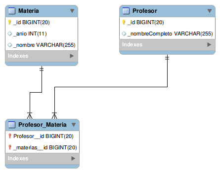

# Profesores y materias

## Objetivo
Testea el mapeo objetos-relacional con Hibernate. El ejemplo muestra cómo modelar la relación muchos a muchos entre profesores y materias.

**IMPORTANTE:** Necesitás instalar un motor de base de datos relacional (te recomendamos MySQL que es OpenSource y gratuito)
 
* En MySQL: hay que crear una base de datos facultad. No hay que correr los scripts, las tablas se recrean cada vez que se corran los tests en xtend.
* e importar el proyecto en Xtend
 
Antes de ejecutarlo, entrá al recurso hibernate.cfg.xml (Ctrl + Shift + R > tipeá hibernate y te aparece) 
y cambiá la contraseña de root de tu base

``` xml
<property name="hibernate.connection.password">xxxxx</property>
```

Si vas a ponerle otro nombre al esquema (base de datos), tenés que modificar la configuración del hibernate.cfg.xml para que apunte allí:

``` xml
<property name="hibernate.connection.url">jdbc:mysql://localhost/facultad</property>
``` 

## Diagrama entidad-relación



