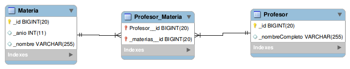

# Profesores y materias

[](https://travis-ci.org/uqbar-project/eg-profesores-materias-hibernate-xtend)  [](https://coveralls.io/github/uqbar-project/eg-profesores-materias-hibernate-xtend?branch=master&service=github)

## Prerrequisitos

Necesitás instalar un motor de base de datos relacional (te recomendamos [MySQL](https://www.mysql.com/) que es OpenSource y gratuito)


## Objetivo
Testea el mapeo objetos-relacional con Hibernate. El ejemplo muestra cómo modelar la relación muchos a muchos entre profesores y materias.

* En MySQL: hay que crear una base de datos facultad. No hay que correr los scripts, las tablas se recrean cada vez que se corran los tests en xtend.

``` sql
CREATE SCHEMA facultad;
```

* Levantar el proyecto de Xtend en base a un "Existing Maven Project"
 
Antes de ejecutarlo, entrá al recurso hibernate.cfg.xml (Ctrl + Shift + R > tipeá hibernate y te aparece) 
y cambiá la contraseña de root de tu base

``` xml
<property name="hibernate.connection.password">xxxxx</property>
```

Si vas a ponerle otro nombre al esquema (base de datos), tenés que modificar la configuración del hibernate.cfg.xml para que apunte allí:

``` xml
<property name="hibernate.connection.url">jdbc:mysql://localhost/facultad</property>
``` 

## Diagrama entidad-relación



